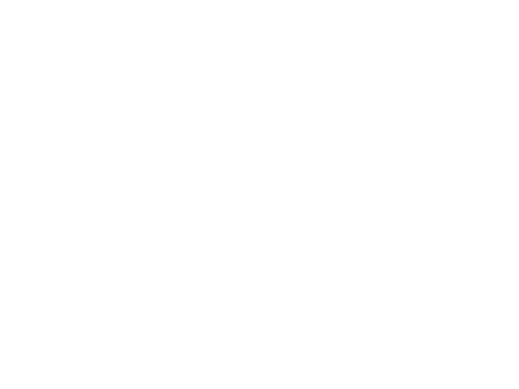

# Cycle Tracker

> 🚧 Work in progress

A personal health data analysis tool for menstrual cycle phase detection using wearable temperature data.

## Status

This project is actively under development. Nothing here is stable yet.

## Goals

- Detect follicular and luteal phases from wearable skin temperature data
- Flag phases that fall outside personal and population-level norms
- Eventually: lightweight local dashboard for cycle visualization

## Population Reference Statistics

Distributions of cycle and luteal phase lengths from the Fehring (2012) dataset, with mean (μ) and standard deviation (σ) markers.

## Data Sources

**Population reference data**
Fehring, R.J. (2012). *Menstrual Cycle Data*. Marquette University ePublications.
[https://epublications.marquette.edu/data_nfp/7/](https://epublications.marquette.edu/data_nfp/7/)

Used to establish population-level distributions of luteal and follicular phase lengths against which personal data is compared.

**Personal data**
Wearable skin temperature and readiness data via personal device API. Not included in this repository.

## Stack

- Python
- Pandas, SciPy
- Streamlit (planned)